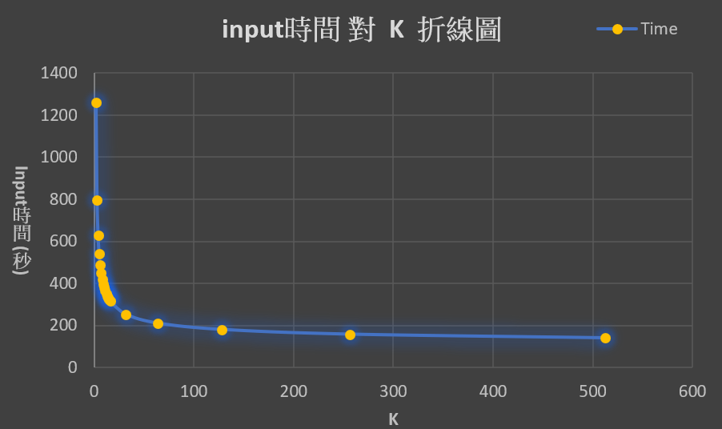
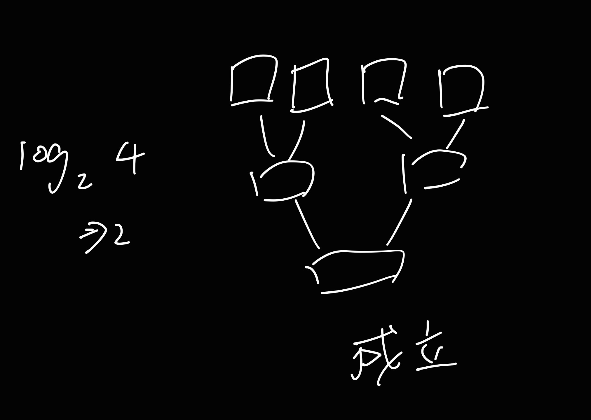
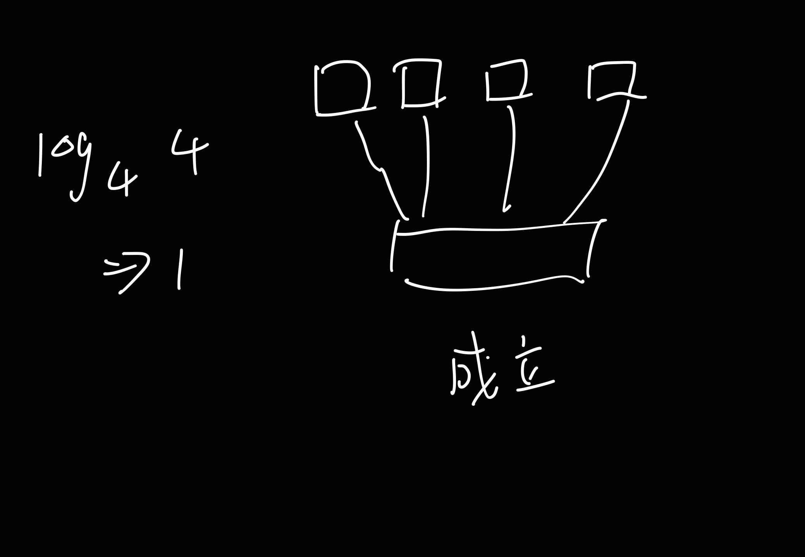
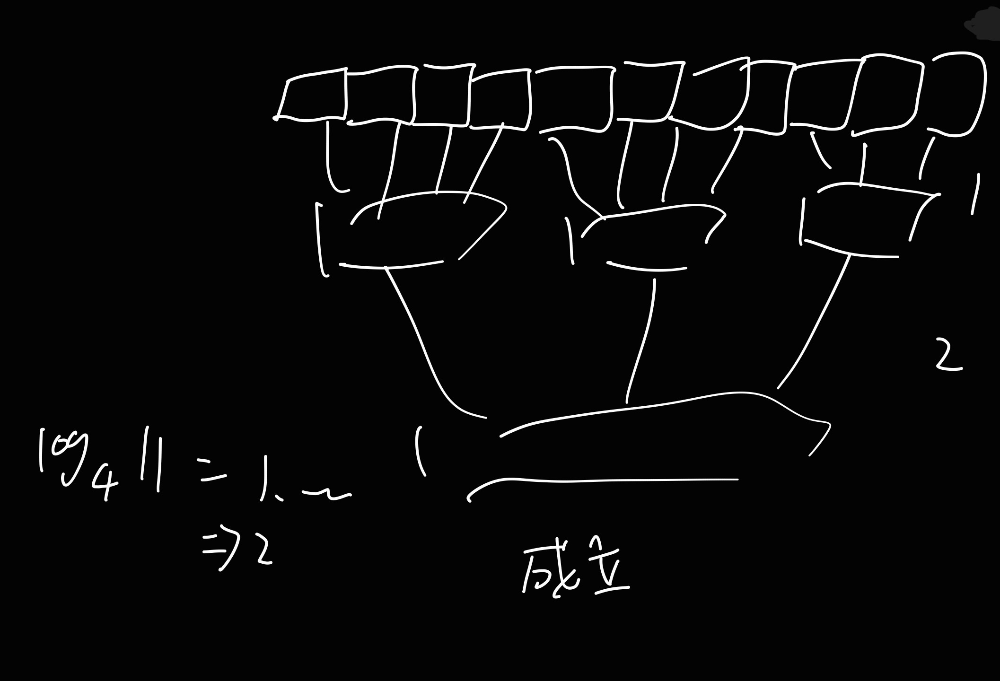

# 41243243

# 41243244

### 組員名單

- 黃安可 41243243
- 黃順駿 41243243

第三題報告

# K-way 外部排序

## 解題說明

本題背景為在記憶體容量有限，排序資料量大於記憶體的情況下 (S << n)，使用課本 (程式 7-21) 進行外部排序

### 解題策略

本題分為兩個部分：

(a)、 推導輸入時間公式：需計算外部排序第二回合（K-way merge）階段的總輸入時間，時間因素包括：

1. 尋道時間 $t_s$

2. 延遲時間 $t_l$

3. 每筆資料的傳輸時間 $t_t$

(b)、 數值分析和圖表繪製：在給定相關參數下，繪製總輸入時間 $t_{input}$ 隨 $k$（每輪合併的 run 數）變化的圖形，並觀察是否存在某個 $k$ 值，使得 $t_{input} \approx t_{CPU}$，輸入所需時間與 CPU 處理時間相近。

### 符號定義

| 參數      | 解釋                          |
| --------- | ----------------------------- |
| $n$       | 資料總筆數                    |
| $m$       | 初始 run 數量                 |
| $S$       | 記憶體容量                    |
| $t_s$     | 磁碟 seek time（尋道時間）    |
| $t_l$     | 磁碟 latency time（延遲）     |
| $t_t$     | 傳送每筆資料的時間            |
| $t_{cpu}$ | CPU 合併所有 run 所花的總時間 |
| $k$       | 每輪合併的 run 數             |

## 程式實作

> [!NOTE]
> 由於本題為純粹計算題，因此本小節將作為解題實作

### 第一小題 (a)

題目要求推導總輸入時間，根據題意輸入時間包含以下:

1. $t_s$ 搜尋時間
2. $t_l$ 延遲時間
3. $t_t$ 傳輸每筆資料的時間

其中 $t_s$ 和 $t_l$ 為磁碟方面花費的時間，因此為每次的**讀取資料需要的開銷**，而 $t_t$ 則與資料筆數成正比，僅在**資料實際傳輸過程中產生**

- ($t_s$ + $t_l$) 乘上 讀取資料的次數 (要排序的資料數/記憶體容量)
- $t_t$ 乘上 要排序的資料數

於是我們可以經由以上推論，定義出以下公式:

### $t_{input}$ = $\frac{n}{S}$ × ($t_s$ + $t_l$) + $n$ × $t_t$

---

### 第二小題 (b)

題目給定了參數值，我們將題目的參數值帶入，整理成以下表格:

| 參數      | 解釋                          | 數值             |
| --------- | ----------------------------- | ---------------- |
| $n$       | 資料總筆數                    | 200,000          |
| $m$       | 初始 run 數量                 | 64               |
| $S$       | 記憶體容量                    | 2,000            |
| $t_s$     | 磁碟 seek time（尋道時間）    | 80 ms = 0.08 sec |
| $t_l$     | 磁碟 latency time（延遲）     | 20 ms = 0.02 sec |
| $t_t$     | 傳送每筆資料的時間            | 0.001 sec        |
| $t_{cpu}$ | CPU 合併所有 run 所花的總時間 |                  |
| $k$       | 每輪合併的 run 數             |

將上述參數值帶入第一小題我們整理出的結論，得到以下結果:

### $t_{input}$ $({Single})$ = $\frac{200,000}{2,000}$ × ($0.08$ + $0.02$) + $200,000$ × $0.001$

### $=$ $100$ $×$ $0.1$ $+$ $200$

得到

### $t_{input}$ $({Single})$ $=$ $210_{sec}$

接著由於每輪會合併的數量為 $k$ ， 而第一輪會產生 $m$ 個 $run$，推敲得出所需合併輪數為:

### $log_k$ $m$ $=$ $log_k$ $64$

### $t_{input}$ $({Total})$ = $t_{input}$ $({Single})$ $×$ $log_k$ $64$

我們使用 Excel 作圖，得到以下曲線

上圖為「輸入時間 $t_{input}$ 隨 $k$（每輪合併的 run 數）變化」的關係圖。可以觀察到以下幾點：

1. 整體趨勢為遞減：

   隨著 $k$ 值增加，每輪能同時合併的 run 數增加，因此所需的合併輪數 $log_k$ $m$ 減少，導致整體輸入時間大幅下降。

2. 下降幅度隨 $k$ 變大而趨緩：

   當 $k$ 從小值（如 $2$, $4$）增加時， $t_{input}$ 明顯下降，但當 $k$ 超過某一範圍（ $k > 50$ ）後，趨於穩定，推測是因為合併輪數已降至 非常少輪就能完成，導致進一步增加 $k$ 的效益有限。

3. 選擇 $k$ 時的取捨考量：

   雖然理論上 $k$ 越大輸入時間越短，但實際上受限於記憶體容量、程式實作複雜度，因此不能一味追求最大 $k$。選擇一個能顯著降低合併輪數，同時不增加過多管理負擔的 $k$ 值，才是合理策略的策略。

### $t_{input} \approx t_{cpu}$ ?

本題假設 $t_{cpu}$ 為一個常數，並未給定一個明確數值， $t_{cpu}$ 表示 CPU 合併所有 run 所花的總時間， 而 $t_{input}$ 表示處理輸入資料所花費的時間

$t_{input}$ 將隨著 $k$ 遞減， $t_{cpu}$ 將保持不變，因此在**某個 $k$ 值附近 $t_{input}$ 可能會接近 $t_{cpu}$**，因此**答案是不確定，但有很大的機會有可能發生 $t_{input} \approx t_{cpu}$ 的情況**

## 效能分析

- ### $t_{input}$ = $\frac{n}{S}$ × ($t_s$ + $t_l$) + $n$ × $t_t$

由此可知當 $S$ 記憶體容量增加，可減少 IO 輸入的時間，能夠一次讀取較多檔案，也就減少讀取搜尋的次數了。但仍需要視實際情況調整平衡經濟考量或系統的資源

- merge 的次數

  需要執行 $O(log_k m)$ 次

時間複雜度: $O(\log_k(m))$ (Merge)

## 測試與驗證

- 驗證 $log_k$ $m$ == 執行 RUN 數

$log_2$ $4$

$log_4$ $4$

$log_4$ $11$

### 結論

得證 $log_k$ $m$ == 執行 RUN 數

## 申論及開發報告

- 使用外部排序中的 K-way 合併能有效降低排序成本。

- 選擇適當的 𝑘 值需平衡合併效率與程式實作負擔。

### 心得

#### 黃安可心得

#### 黃順駿心得
